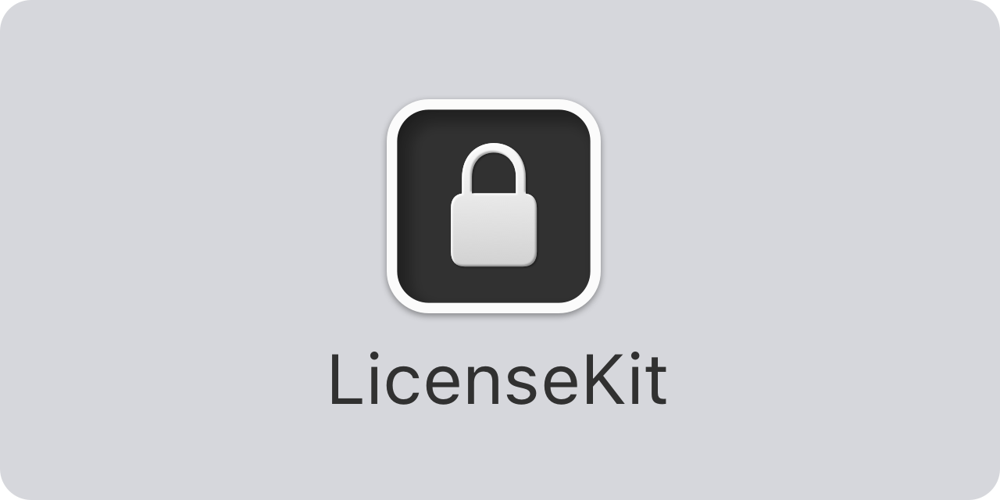

<p align="center">
    
</p>

<p align="center">
    
    
    <a href="https://twitter.com/getlicensekit">
        
    </a>
    <a href="https://techhub.social/@licensekit">
        
    </a>
</p>


## About LicenseKit

LicenseKit helps you protect your Swift-based apps and libraries with commercial licenses.

LicenseKit lets you set up licenses in `code`, in `files`, fetch them from `external apis` etc. LicenseKit licenses can specify an `expiration date`, supported `platforms` (iOS, macOS, tvOS, watchOS), `bundle IDs`, `tier`, customizable `features` etc. which means that you can fully tailor your license offering.

LicenseKit requires a commercial license to be used. You can purchase a license from the [LicenseKit website][Website] or use `FREE` as license key to use the library with a limited number of licenses and features.

LicenseKit supports `iOS 13`, `macOS 12`, `tvOS 13` and `watchOS 6`. 


## Installation

LicenseKit can be installed with the Swift Package Manager:

```
https://github.com/LicenseKit/LicenseKit.git
```

LicenseKit only has to be added to the main app target. If you are using LicenseKit with a library, make sure to set up your Swift package so that your users get both your library and LicenseKit when fetching your package, or add the LicenseKit binary to your library distributable.


## Getting started

The [online documentation][Documentation] has a [getting started guide][Getting-Started] that will help you get started with LicenseKit.

Basically, you should first create a `LicenseEngine` with your LicenceKit license key. If you received `ABC123` as license key when signing up for LicenseKit, the code could look like this:

```swift
// You can use FREE as license key to test the trial version
let engine = try LicenseEngine(licenseKey: "ABC123") { license in
    LocalLicenseService(
        license: license,
        licenses: [
            License(licenseKey: "license-key-1"),
            License(licenseKey: "license-key-2")
        ]
    )
}
```

If the license key is valid and refers to a valid license, the license engine will be created with the service you define in the service builder. If not, a ``LicenseError`` is thrown.

Once you have a license engine, you can use it to handle customer licenses:

```swift
let license = try await engine.getLicense(for: "customer license key")
```

Just like when creating a license engine, the license will be returned if the license key is valid and refers to a valid license, otherwise a ``LicenseError`` is thrown. 

Licenses can specify customer information, tier, activation and expiration dates, supported platforms (iOS, macOS, tvOS, watchOS), bundle IDs, features etc. 

You can use licenses to protect functionality in your app or library. For instance, this class requires a `.gold` tier OR that the license includes a certain feature:

```swift
public class MyVerySpecialClass {

    public init() throws {
        try license.validate(feature: .myCoolFeature, or: .gold)
        ...
    }

    ...
}
```

This makes it impossible to create instances without a valid license, since the initializer will throw an error if the license is invalid.

For more information, please see the [online documentation][Documentation] and [getting started guide][Getting-Started].


## Documentation

The [online documentation][Documentation] has articles, code examples etc. that let you overview the various parts of the library.


## Demo Application

The demo app lets you try out the library on iOS and macOS. Just open and run the `Demo` project.


## Contact

Feel free to reach out if you have any questions or need help any way:

* Website: [getlicensekit.com][Website]
* Mastodon: [@getlicensekit@techhub.social][Mastodon]
* Twitter: [@getlicensekit][Twitter]
* E-mail: [info@getlicensekit.com][Email]


## License

LicenseKit requires a commercial license to be used. You can purchase a license from the [LicenseKit website][Website] or use `FREE` as license key to use the library with a limited number of licenses and features.

See the [LICENSE][License] file for more info.


[Email]: mailto:info@getlicensekit.coms
[Website]: https://getlicensekit.com
[Twitter]: https://twitter.com/getlicensekit
[Mastodon]: https://techhub.social/@licensekit
[Sponsors]: https://github.com/sponsors/danielsaidi

[Documentation]: https://licensekit.github.io/LicenseKit/documentation/licensekit/
[Getting-Started]: https://licensekit.github.io/LicenseKit/documentation/licensekit/getting-started
[License]: https://github.com/LicenseKit/LicenseKit/blob/main/LICENSE
