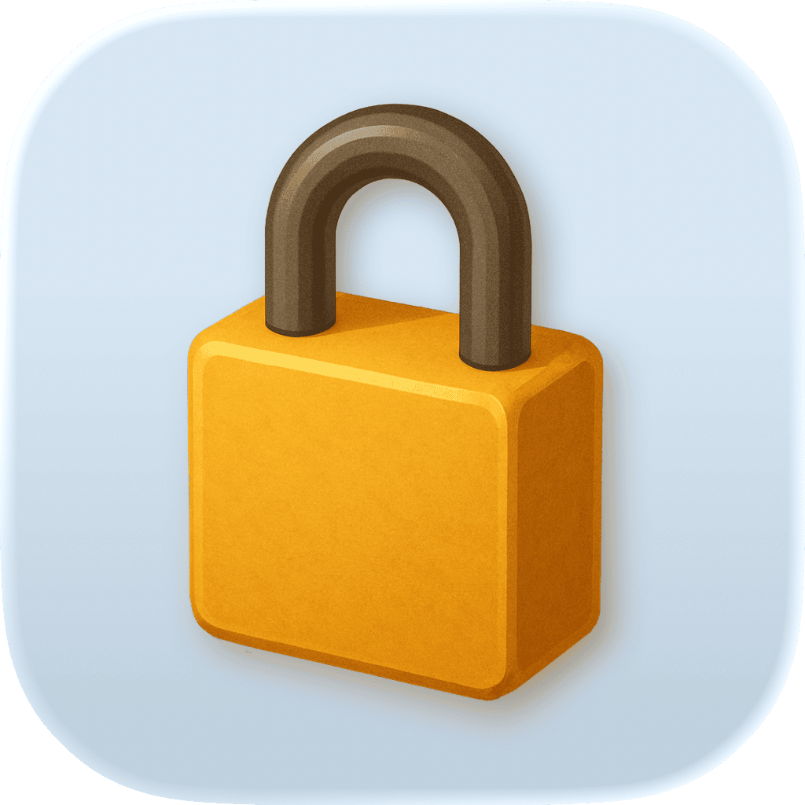

<p align="center">
    
</p>

<p align="center">
    
    
    <a href="https://kankoda.github.io/LicenseKit"></a>
    <a href="https://kankoda.com/licensekit"></a>
</p>


# LicenseKit

LicenseKit is a Swift SDK that lets you protect your apps and SDKs with commercial licenses on all Apple platforms (iOS, macOS, tvOS, watchOS & visionOS).

LicenseKit can define licenses with code, generate and parse encrypted license files, read licenses from plain CSV files, integrate with external APIs, etc. It also has a pre-defined Gumroad integration.


## Pricing

LicenseKit requires a commercial license to be used. It's free to start using, and affordable to scale. You can sign up for a license or try out a free, unlimited trial from the [LicenseKit website][Website].


## Installation

LicenseKit can be installed with the Swift Package Manager:

```
https://github.com/Kankoda/LicenseKit.git
```

LicenseKit only has to be linked to the main target. If you use LicenseKit with a Swift package, make sure to set up your package as described in the [online documentation][Documentation].

> [!NOTE]
> Starting with LicenseKit 2.1, each release will include a multiplatform build. The tag name for a multiplatform release is the version number followed by `-multiplatform`. If this proves successful, the multiplatform build will replace the iOS exclusive one in a future update.


## Getting started

With LicenseKit, your app/library should create a ``LicenseEngine`` with your [LicenseKit license key][Website], then define which service type you want to use to use to fetch customer licenses:

```swift
let licenseEngine = try await LicenseEngine(
    licenseKey: "your-license-key",
    licenseStore: .myInternalLicenseStore // optional
    licenseService: { yourLicense in
        .api(...)  // or...
        .binary(...)  // or...
        .csvFile(...)  // or...
        .encryptedFile(...)  // or...
        .gumroad(...)  // etc...
    }
)
```

There are many services to choose from, as described in the [license services article][Services]. You can define licenses with source code, read licenses from file, fetch licenses from an API, integrate with services like Gumroad, etc.

Once you have a license engine instance, you can use it to resolve and validate licenses for your product, by letting your customers enter *their* license key. See the [getting-started guide][Getting-Started] for more information.


## Features

LicenseKit provides you with services, integrations and apps that make it easy to manage licenses. 

### Services

LicenseKit services make it easy to define, fetch, and validate licenses in different ways, for instance:

* 🌩️ [API Integrations][Services] - LicenseKit can integrate with any REST API.
* 🌩️ [Gumroad][Services] - LicenseKit can integrate directly with Gumroad.
* ⌨️ [Binary Licenses][Services] - LicenseKit lets you define licenses with source code.
* 📄 [CSV Files][Services] - LicenseKit lets you define licenses with plain CSV files.
* ⌨️ [License Files][Services] - LicenseKit lets you define licenses with source code.

### Apps

LicenseKit has SwiftUI-based apps that can be used directly from within Xcode Previews or embedded in an app:
 
* 💻 [License Manager][Apps] - Inspect a collection of licenses and license services.


## Documentation

The [online LicenseKit documentation][Documentation] has articles, code examples, etc. to get you started. See the [Understanding Licenses][Licenses] and [Understanding License Services][Services] articles for more information.


## Demo Application

The demo app lets you try out the library on iOS and macOS. Just open and run the `Demo` project.


## Contact

LicenseKit is property of Kankoda:

* [E-mail][Email]
* [Website][Website]
* [Bluesky][Bluesky]
* [Mastodon][Mastodon]

Reach out if you have any questions, want to sign up for a license, or need help in any way.


## License

LicenseKit is closed source. See the [LICENSE][License] file for more info.


[Email]: mailto:info@kankoda.com
[Website]: https://kankoda.com/licensekit
[GitHub]: https://github.com/kankoda

[Bluesky]: https://bsky.app/profile/kankoda.bsky.social
[Twitter]: https://twitter.com/kankodahq
[Mastodon]: https://mastodon.social/@kankoda

[Documentation]: https://kankoda.github.io/LicenseKit/documentation/licensekit
[Getting-Started]: https://kankoda.github.io/LicenseKit/documentation/licensekit/getting-started-article
[License]: https://github.com/Kankoda/LicenseKit/blob/main/LICENSE

[Apps]: https://kankoda.github.io/LicenseKit/documentation/licensekit
[Licenses]: https://kankoda.github.io/LicenseKit/documentation/licensekit/understanding-licenses
[Services]: https://kankoda.github.io/LicenseKit/documentation/licensekit/understanding-services
