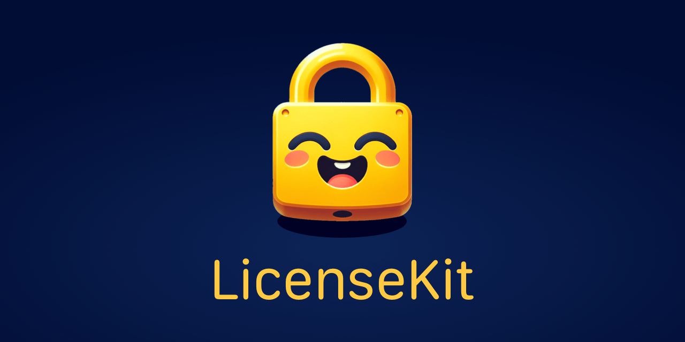

# LicenseKit

<p align="center">
    
</p>

<p align="center">
    
    
    
    
    <a href="https://twitter.com/danielsaidi">
        
    </a>
</p>


## About LicenseKit

LicenseKit helps you protect your closed-source `Swift` libraries behind a commercial license.

With LicenseKit, you can require a license key before developers can start using your libraries.

LicenseKit supports standard and custom license models. This means that a LicenseKit license can specify things like expiration date, valid bundle IDs etc. but also domain-specific features.


## Platform Support

LicenseKit supports the following platforms:

* iOS 13.0
* macOS 11.0
* tvOS 13.0
* watchOS 6.0

This means that you can distribute your closed-source licensed to all major Apple platforms.


## Installation

The best way to install LicenseKit is with the Swift Package Manager.

```
https://github.com/danielsaidi/LicenseKit.git
```

LicenseKit must also be added to any application that uses your library.


## Getting started

Once LicenseKit is added to your project, you need to obtain a license before you can start using it.

[Read more here][Getting-Started]


## Documentation

The LicenseKit documentation contains extensive information, code examples etc. and makes it easy to overview the various parts of the library.

You can either [download][Documentation] the documentation or build it directly in Xcode, using `Product/Build Documentation`.


## Contact

Feel free to reach out if you have questions or if you want to contribute in any way:

* E-mail: [daniel.saidi@gmail.com][Email]
* Twitter: [@danielsaidi][Twitter]
* Website: [danielsaidi.com][Website]


## License

LicenseKit is closed source. See the [LICENSE][License] file for more info.


[Email]: mailto:daniel.saidi@gmail.com
[Twitter]: http://www.twitter.com/danielsaidi
[Website]: https://getlicensekit.com
[Licenses]: https://getlicensekit.com/pro

[Documentation]: https://github.com/danielsaidi/Documentation/blob/main/Docs/LicenseKit.doccarchive.zip?raw=true
[License]: https://github.com/danielsaidi/LicenseKit/blob/master/LICENSE

[Getting-Started]: https://github.com/danielsaidi/LicenseKit/blob/master/Readmes/Getting-Started.md
