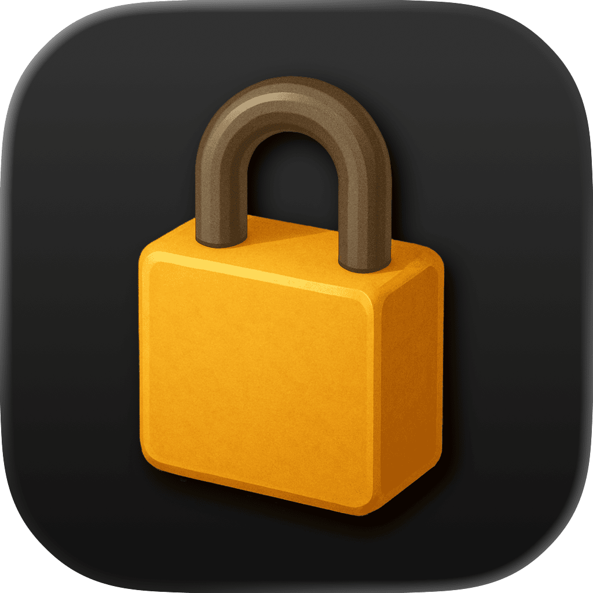

<p align="center">
    
</p>

<p align="center">
    
    
    <a href="https://kankoda.github.io/LicenseKit"></a>
    <a href="https://kankoda.com/licensekit"></a>
</p>


# LicenseKit

LicenseKit is a Swift SDK that lets you protect your software with commercial licenses on all major Apple platforms (iOS, macOS, tvOS, watchOS & visionOS). You can use it require a license to use your software.

LicenseKit lets you add licenses with code, read licenses from CSV and encrypted files, integrate with any 3rd party API, like Gumroad, etc. Licenses can be validated on expiration date, bundle IDs, features, platforms, environments, etc. 

LicenseKit can cache licenses to handle connectivity loss, and combine multiple sources for flexible and thread-safe license validation.


## Installation

LicenseKit can be installed with the Swift Package Manager:

```
https://github.com/Kankoda/LicenseKit.git
```


## Pricing

LicenseKit requires a commercial license to be used. It's free to start using, and affordable to scale. You can sign up for a license or try out a free, unlimited trial from the [LicenseKit website][Website].


## Getting started

The [getting-started guide][Getting-Started] article describes how to get started with LicenseKit. The [Licenses][Licenses] article then digs deeper and explains the license model, [License Services][License-Services] the available services, and [License Files][License-Files] how to generate encrypted license files.


## Documentation

The [online LicenseKit documentation][Documentation] has articles, code examples, etc. to get you started with LicenseKit.


## Demo Application

The demo app lets you try out the library on iOS and macOS. Just open and run the `Demo` project.


## Contact

LicenseKit is property of Kankoda:

* [E-mail][Email]
* [Website][Website]
* [Bluesky][Bluesky]
* [Mastodon][Mastodon]

Reach out if you have any questions, want to sign up for a license, or need help in any way.


## License

LicenseKit is closed source. See the [LICENSE][License] file for more info.


[Email]: mailto:info@kankoda.com
[Website]: https://kankoda.com/licensekit
[GitHub]: https://github.com/kankoda

[Bluesky]: https://bsky.app/profile/kankoda.bsky.social
[Twitter]: https://twitter.com/kankodahq
[Mastodon]: https://mastodon.social/@kankoda

[Documentation]: https://kankoda.github.io/LicenseKit/documentation/licensekit
[Getting-Started]: https://kankoda.github.io/LicenseKit/documentation/licensekit/getting-started-article
[License]: https://github.com/Kankoda/LicenseKit/blob/main/LICENSE

[Licenses]: https://kankoda.github.io/LicenseKit/documentation/licensekit/licenses-article
[License-Services]: https://kankoda.github.io/LicenseKit/documentation/licensekit/license-services-article
[License-Files]: https://kankoda.github.io/LicenseKit/documentation/licensekit/license-files-article
