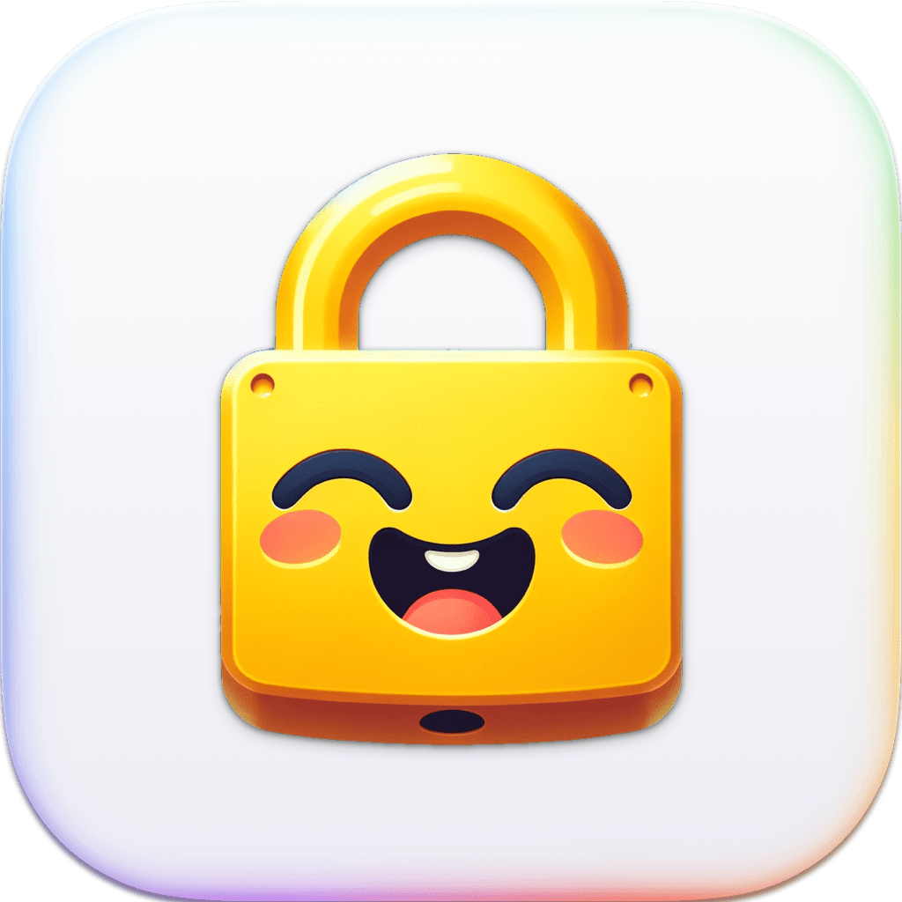

<p align="center">
    
</p>

<p align="center">
    
    
    <a href="https://kankoda.github.io/LicenseKit"></a>
    
</p>


# LicenseKit

LicenseKit lets you protect your software with commercial licenses on major Apple platforms (iOS, macOS, tvOS, watchOS & visionOS). You can use it with boths apps and libraries, to require a license to use your software.

LicenseKit lets you define licenses with code, read licenses from plain and encrypted files, validate licenses from an API, and integrate with external services like Gumroad, etc. 

LicenseKit can validate expiration date, platform, bundle ID, tier, environment, features, and much more. It lets you cache licenses to handle temporary connectivity loss, and combine multiple data sources for flexible validation.


## Pricing

LicenseKit requires a commercial license to be used. It's free to start using, using the limited "FREE" license key, and affordable to scale. You can purchase a license or try out a free, unlimited trial from the [LicenseKit website][Website].


## Installation

LicenseKit can be installed with the Swift Package Manager:

```
https://github.com/Kankoda/LicenseKit.git
```

LicenseKit only has to be linked to the main target. If you use LicenseKit with a Swift package, make sure to set up your package to fetch both your library and LicenseKit.


## Features

LicenseKit makes it easy to define, fetch, and validate licenses in many different ways, for instance:

* 🌩️ [API Integrations][Services] - LicenseKit can validate licenses with web requests.
* ⌨️ [Binary Licenses][Services] - LicenseKit lets you define licenses with source code.
* 📄 [CSV Files][Services] - LicenseKit lets you define licenses with plain text files.
* ⌨️ [Encrypted Files][Services] - LicenseKit lets you define licenses with source code.
* 💰 [Gumroad Integration][Services] - LicenseKit can integrate directly with Gumroad.

LicenseKit can also cache any service and combine multiple licenses:
 
* 📦 [Caching][Services] - LicenseKit can cache valid licenses.
* ➡️ [Proxying][Services] - LicenseKit can combine multiple services.

See the [Understanding Licenses][Licenses] and [Understanding License Services][Services] articles for more information about licenses and services.


## Getting started

With LicenseKit, your app/library should create a ``LicenseEngine`` with the license key you obtain when you [sign up for LicenseKit][Website], then define which ``LicenseServiceType`` you want to use to use to fetch and validate customer licenses.

For instance, this would create a license engine with two licenses that are compiled into your product and will be validated on-device:

```swift
let licenseEngine = try await LicenseEngine(
    licenseKey: "your-license-key",
    licenseStore: .myInternalLicenseStore // optional
    licenseService: { 
        .binary(
            licenses: [
                License(licenseKey: "license-key-1", ...),
                License(licenseKey: "license-key-2", ...)
            ]
        )
    }
)
```

There are many service types to choose from, as described in the [license services article][Services]. You can define licenses with source code, read licenses from file, fetch licenses from an API, integrate with services like Gumroad, etc.

Once you have a license engine, you can use it to resolve and validate licenses for your product, by letting users enter *their* license key.

See the [getting-started guide][Getting-Started] for more information, and for how to set up license activation for apps and libraries.


## Documentation

The [online documentation][Documentation] has articles, code examples etc. that let you overview the various parts of the library.


## Demo Application

The demo app lets you try out the library on iOS and macOS. Just open and run the `Demo` project.


## Contact

LicenseKit is handled by Kankoda:

* [E-mail][Email]
* [Website][Website]
* [Bluesky][Bluesky]
* [Mastodon][Mastodon]

Reach out if you have any questions or need help any way.


## License

LicenseKit is closed source. See the [LICENSE][License] file for more info.


[Email]: mailto:info@kankoda.com
[Website]: https://kankoda.com/licensekit
[GitHub]: https://github.com/kankoda

[Bluesky]: https://bsky.app/profile/kankoda.bsky.social
[Twitter]: https://twitter.com/kankodahq
[Mastodon]: https://mastodon.social/@kankoda

[Documentation]: https://kankoda.github.io/LicenseKit/documentation/licensekit
[Getting-Started]: https://kankoda.github.io/LicenseKit/documentation/licensekit/getting-started-article
[License]: https://github.com/Kankoda/LicenseKit/blob/main/LICENSE

[Licenses]: https://kankoda.github.io/LicenseKit/documentation/licensekit/understanding-licenses
[Services]: https://kankoda.github.io/LicenseKit/documentation/licensekit/understanding-services
